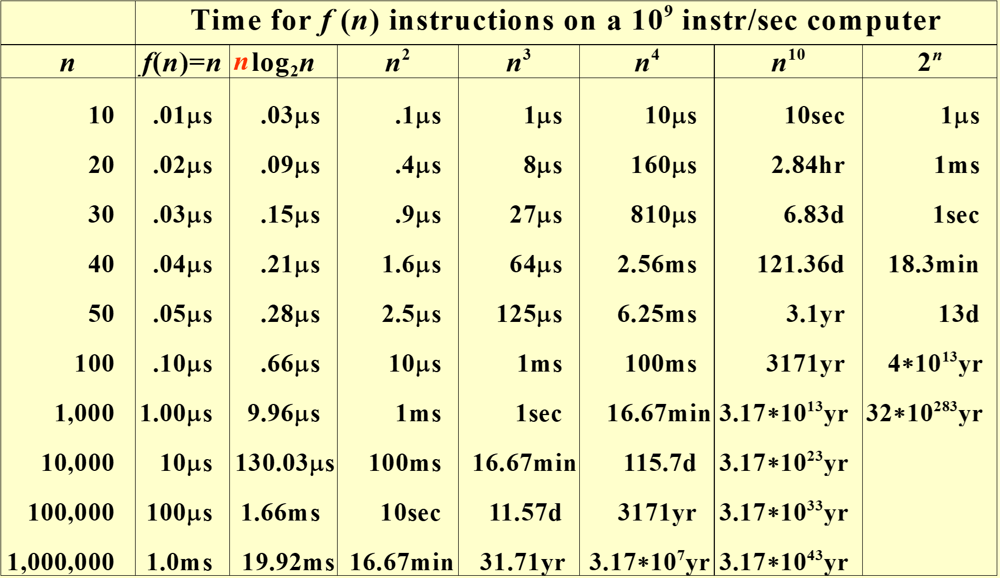

# WEEK 1

jkzhu@zju.edu.cn  朱建科

11921102@zju.edu.cn  林利翔

zijinxuxu@zju.edu.cn  任金伟

冬学期第一周/第二周 Mid-Term (15)

***


## 1 Algorithm Analysis

#### [Definition] An *algorithm* is a finite set of instructions that, if followed, accomplishes a particular task. In addition, all algorithms must satisfy the following criteria.

1. **Input** : There are zero or more quantities that are externally supplied.

2. **Output** : At least one quantity is produced.

3. **Definiteness** : Each instruction is clear and unambiguous.

4. **Finiteness** : the algorithm terminates after finite number of steps

5. **Effectiveness** : basic enough to be carried out ; feasible

-  A program does not have to be finite. (eg. an operation system)

- An algorithm can be described by human languages, flow charts, some programming languages, or pseudocode.

#### [Example] Selection Sort: Sort a set of $n\geq1$ integers in increasing order

```pseudocode
for (i=0;i<n;i++){
	Examine list[i] to list[n-1] and suppose that the smallest integer is at list[min];
	Interchange list[i] and list[min];
}
```

***

### 1.1 What to Analyze

- Machine and compiler-dependent run times.

- Time and space complexities : machine and compiler independent.

- Assumptions:

  >1. instructions are executed sequentially 顺序执行
  >
  >2. each instruction is simple, and takes exactly one time unit
  >3. integer size is fixed and we have infinite memory

* $T_{avg}(N)\, and\, T_{worst}(N)$ --> the average and worst case time complexities as functions of input size $N$

#### [Example] Matrix addition 

```c
void add(int a[][MAX_SIZE],
         int b[][MAX_SIZE],
         int c[][MAX_SIZE],
         int rows, int cols) 
{
	int i, j;
	for (i=0; i<rows; i++)/*rows+1*/
		for (j=0;j<cols;j++)/*rows(cols+1)*/
			c[i][j] = a[i][j]+b[i][j];/*rows*cols*/
}
```

$$
T(rows, cols) = 2rows\times cols + 2rows+1
$$

非对称

#### [Example] Iterative function for summing a list of numbers

```c
float sum (float list[], int n)
{  /*add a list of numbers*/
	float tempsum = 0; /*count = 1*/
	int i;
	for (i=0; i<n; i++)
        /*count++*/
		tempsum  += list[i]; /*count++*/
    /*count++ for last excutaion of for*/
   return tempsum; /*count++*/
}
```

$$
T_{sum}(n)=2n+3
$$

#### [Example] Recursive function for summing a list of numbers

```c
float rsum (float list[], int n)
{/*add a list of numbers*/
	if (n) /*count++*/
		return rsum(list, n-1) + list[n-1];
		/*count++*/
    return 0; /*count++*/
}
```

$$
T_{rsum}(n)=2n+2
$$

But it takes more time to compute each step.

***

## 1.2 Asymptotic Notation($O,\Omega,\Theta,o$) 

* predict the growth ; compare the time complexities of two programs ; asymptotic(渐进的) behavior

#### [Definition] $T(N)=O(f(N))$ if there are positive constants $c$ and $n_0$ such that $T(N)\leq c\cdot f(N)$ for all $N\geq n_0$.(*upper bound*)

#### [Definition] $T(N)=\Omega(g(N))$ if there are positive constants $c$ and $n_0$ such that $T(N)\geq c\cdot f(N)$ for all $N\geq n_0$.(*lower bound*)

#### [Definition] $T(N)=\Theta(h(N))$ if and only if $T(N)=O(h(N))$ and $T(N)=\Omega(h(N))$.

#### [Definition] $T(N)=o(p(N))$ if $T(n)=O(p(N))$ and $T(N)\neq\Theta(p(N))$.

- $2N+3=O(N)=O(N^{k\geq1})=O(2^N)=\ldots$ take the **smallest** $f(N)$

- $2^N+N^2=\Omega(2^N)=\Omega(N^2)=\Omega(N)=\Omega(1)=\ldots$ take the **largest** $g(N)$

- Rules of Asymptotic Notation

  >1. If $T_1(N)=O(f(N))$ and $T_2=O(g(N))$, then
  >
  >   (1) $T_1(N)+T_2(N)=max(O(f(N)),O(g(N)))$
  >
  >   (2) $T_1(N)*T_2(N)=O(f(N)*g(N))$
  >
  >2. 若$T(N)$是一个$k$次多项式，则$T(N)=\Theta(N^k)$
  >
  >3. $log_kN=O(N)$ for any constant $k$ (**logarithms grow very slowly**)




#### [Example] Matrix addition 

```C
void add(int a[][MAX_SIZE],
         int b[][MAX_SIZE],
         int c[][MAX_SIZE],
         int rows, int cols) 
{
	int i, j;
	for (i=0; i<rows; i++)
		for (j=0;j<cols;j++)
			c[i][j] = a[i][j]+b[i][j];
}
```

$$
T(rows,cols)=\Theta(rows\cdot cols)
$$

#### General Rules

> - **For loops** : The running time of a for loop is at most the running time of the statements inside the for loop (including tests) times the number of iterations.
>
> - **Nested for loops** : The total running time of a statement inside a group of nested loops is the running time of the statements multiplied by the product of the sizes of all the for loops.
>
> - **Consecutive statements** : These just add (which means that the maximum is the one that counts).
>
> - **If/else** : For the fragment
>   		if ( Condition )  S1;
>     		else  S2;
>
>   the running time is never more than the running time of the test plus the larger of the running time of S1 and S2.
>
> - **Recursions** : 
>
>   **[Example] Fibonacci number**
>   $$
>   Fib(0)=Fib(1)=1, Fib(n)=Fib(n-1)+Fib(n-2)
>   $$
>
>   ```c
>   lont int Fib (int N) /*T(N)*/
>   {
>   	if (N<=1) /*O(1)*/
>   		return 1; /*O(1)*/
>   	else
>   		return Fib(N-1)+Fib(N-2);
>   }      /*O(1)*//*T(N-1)*//*T(N-2)*/
>   ```
>
>   $$
>   T(N)=T(N-1)+T(N-2)+2\geq Fib(N)\\
>   \left(\frac{3}{2} \right)^n\leq Fib(N)\leq\left(\frac{5}{3}\right)^n
>   $$
>
>   时间复杂度：$O(2^N)$      $T(N)$ grows **exponentially**
>   
>   空间复杂度：$O(N)$


