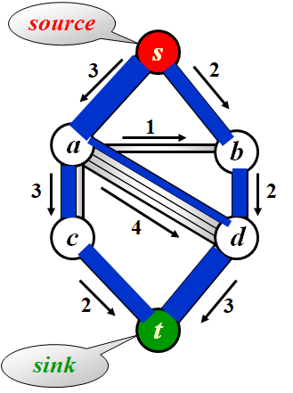

# WEEK 10

### 6.5 Network Flow Problems



- Determine the maximum amount of flow that can pass from $s$ to $t$.

> Note : Total coming in ($v$) = Total going out ($v$) where $v \notin \{ s, t \}$

#### A Simple Algorithm

- 流图$G_f$表示算法的任意阶段已经达到的流，开始时$G_f$的所有边都没有流，算法终止时$G_f$包含最大流
- 残余图(residual graph)$G_r$表示对于每条边还能添加上多少流，$G_r$的边叫做残余边(residual edge)

>**Step 1** : Find any path from $s$ to $t$ in $G_r$ , which is called augmenting path(增长通路).
>
>**Step 2** : Take the minimum edge on this path as the amount of flow and add to $G_f$.
>
>**Step 3** : Update $G_r$ and remove the 0 flow edges.
>
>**Step 4** : If there is a path from $s$ to $t$ in $G_r$ then go to Step 1, or end the algorithm.

- Step 1中初始选择的路径可能使算法不能找到最优解，贪心算法行不通

#### A solution

- allow the algorithm to **undo** its decisions
- For each edge $( v, w )$ with flow $f_{v, w}$ in $G_f$, add an edge $( w, v )$ with flow $f_{v, w}$ in $G_r$ .
- Note : The algorithm works for $G$ with **cycles** as well.

##### [Proposition] If the edge capabilities are *rational numbers*, this algorithm always terminate with a maximum flow.

#### Analysis

- An augmenting path can be found by an unweighted shortest path algorithm.

- $T=O(f*|E|)$ where $f$ is the maximum flow.

- Always choose the augmenting path that allows the largest increase in flow

  - 对Dijkstra算法进行单线(single-line)修改来寻找增长路径
  - $cap_{max}$为最大边容量

  $$
  T=T_{augmentation}*T_{find\_a\_path}\\
  =O(|E|\log cap_{max})*O(|E|\log|V|)\\
  =O(|E|^2\log|V|\log cap_{max})
  $$

- Always choose the augmenting path that has the least number of edges

  - 使用无权最短路算法来寻找增长路径

  $$
  T=T_{augmentation}*T_{find\_a\_path}\\
  =O(|E|)*O(|E||V|)\\
  =O(|E|^2|V|)
  $$

>Note : 
>
>- If every $v \notin \{ s, t \}$ has either a single incoming edge of capacity 1 or a single outgoing edge of capacity 1, then time bound is reduced to $O( |E| |V|^{1/2} )$.
>- The **min-cost flow** problem is to find, among all maximum flows, the one flow of minimum cost provided that each edge has a cost per unit of flow.

---

### 6.6 Minimum Spanning Tree

##### [Definition] A *spanning tree* of a graph $G$ is a tree which consists of $V(G)$ and a subset of $E(G)$

> Note :
>
> - The minimum spanning tree is a tree since it is acyclic, the number of edges is $|V|-1$
> - It is minimum for the total cost of edges is minimized.
> - It is spanning because it covers every vertex.
> - A minimum spanning tree exists if $G$ is connected.
> - Adding a non-tree edge to a spanning tree, we obtain a cycle.

##### Greedy Method

Make the best decision for each stage, under the following constrains :

>- we must use only edges within the graph
>- we must use exactly $|V|-1$ edges
>- we may not use edges that would produce a cycle

1. Prim’s Algorithm

   - 在算法的任一时刻，都可以看到一个已经添加到树上的顶点集，而其余顶点尚未加到这棵树中
   - 算法在每一阶段都可以通过选择边$(u, v)$，使得$(u,v)$的值是所有$u$ 在树上但$v$不在树上的边的值中的最小者，而找出一个新的顶点并把它添加到这棵树中
   
2. Kruskal’s Algorithm

   - 连续地按照最小的权选择边,，并且当所选的边不产生环时就把它作为取定的边

     ```pseudocode
     void Kruskal( Graph G )
     {   
     	T = { };
         while ( T contains less than |V|-1 edges && E is not empty ) 
         {
             choose a least cost edge (v, w) from E;  /*DeleteMin*/
             delete (v, w) from E;
             if ( (v, w) does not create a cycle in T )     
     			add (v, w) to T;  /*Union/Find*/
             else     
     			discard (v, w);
         }
         if ( T contains fewer than |V|-1 edges )
         	Error( “No spanning tree” );
     }
     ```

     ```c
     void Kruskal(Graph G)
     {
     	int EdgesAccepted;
     	DisjSet S;
     	PriorityQueue H;
     	Vertex U, V;
     	SetType Uset, Vset;
     	Edge E;
         
     	Initialize(S);
     	ReadGraphIntoHeapArray(G, H);
     	BuildHeap(H);
         
     	EdgesAccepted = 0;
     	while(EdgesAccepted < NumVertex-1)
     	{
     		E = DeleteMin(H); /*E = (U,V)*/
     		Uset = Find(U, S);
     		Vset = Find(V, S);
     		if(Uset != Vset)
     		{
     			/*Accept the edge*/
     			EdgesAccepted++;
     			SetUnion(S, USet, VSet);
     		}
     	}
     }
     ```

     $$
     T=O(|E|\log|E|)
     $$

     
