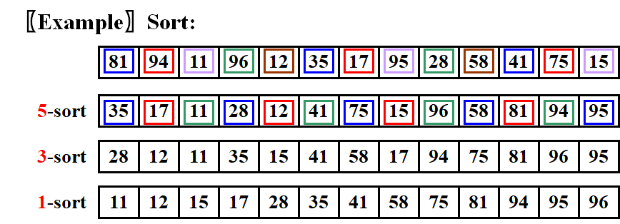

# WEEK 12

### 7.4 Shellsort



- Define an **increment sequence** $h_1 < h_2 < \cdots < h_t  ( h_1 = 1 )$
- Define an $h_k$-sort at each phase for $k = t, t - 1,\cdots, 1$

- 最后一轮就是Insertion Sort

> Note : An $h_k$-sorted file that is then $h_{k-1}$-sorted remains $h_k$-sorted.

#### Shell’s Increment Sequence

$$
h_t=\lfloor N/2\rfloor,h_k=\lfloor h_{k+1}/2\rfloor
$$

```c
void Shellsort( ElementType A[ ], int N ) 
{ 
    int i, j, Increment; 
    ElementType Tmp; 
    for ( Increment = N / 2; Increment > 0; Increment /= 2 )  /*h sequence */
		for ( i = Increment; i < N; i++ ) 
        { /* insertion sort */
        	Tmp = A[ i ]; 
	    	for ( j = i; j >= Increment; j -= Increment ) 
            	if( Tmp < A[ j-Increment ] )
                	A[ j ] = A[ j-Increment ]; 
        		else 
		    		break; 
			A[ j ] = Tmp; m
		} /* end for-I and for-Increment loops */
}
```

- [Theorem] The worst-case running time of Shellsort, using Shell’s increments, is  $\Theta( N^2 )$.

#### Hibbard's Increment Sequence

$$
h_k=2^k-1
$$

- [Theorem] The worst-case running time of Shellsort, using Hibbard's increments, is  $\Theta( N^{3/2} )$.

#### Conjecture

- $T_{avg – Hibbard} ( N ) = O ( N^{5/4} )$
- Sedgewick’s best sequence is $\{1, 5, 19, 41, 109, \cdots \}$ in which the terms are either of the form $9\times4^i – 9\times2^i + 1$ or 
  $4^i – 3\times2^i + 1$.  $T_{avg} ( N ) = O ( N^{7/6} )$ and $T_{worst}( N ) = O( N^{4/3} )$.

#### Conclusion

- Shellsort is a very simple algorithm, yet with an extremely complex analysis.  
- It is good for sorting up to moderately large input (tens of thousands).

### 7.5 Heapsort

#### Algorithm1

```c
void Heapsort( int N ) 
{
    BuildHeap( H );
    for ( i = 0; i < N; i++ ) 
		TmpH[ i ] = DeleteMin( H );
    for ( i = 0; i < N; i++ ) 
		H[ i ] = TmpH[ i ];
}
```

$$
T(N)=O(N\log N)
$$

- The space requirement is doubled.

#### Algorithm2

```c
void Heapsort( ElementType A[ ], int N ) 
{
	int i; 
    for ( i = N / 2; i >= 0; i-- ) /*BuildHeap*/ 
    	PercDown( A, i, N ); 
    for ( i = N - 1; i > 0; i-- ) 
    { 
        Swap( &A[ 0 ], &A[ i ] ); /*DeleteMax*/ 
        PercDown( A, 0, i ); 
    } 
}
```

- [Theorem] The average number of comparisons used to heapsort a random permutation of N distinct items is $2N\log N-O(N\log\log N)$.

> Note : Although Heapsort gives **the best average time**, in practice it is slower than a version of Shellsort that uses Sedgewick’s increment sequence.

### 7.6 Mergesort

```c
void MSort( ElementType A[ ], ElementType TmpArray[ ], int Left, int Right ) 
{   
    int Center; 
    if ( Left < Right ) 
    {  /*if there are elements to be sorte*/
		Center = (Left+Right)/2; 
		MSort(A, TmpArray, Left, Center); 	/*T(N/2)*/
		MSort(A, TmpArray, Center+1, Right); 	/*T(N/2)*/
		Merge(A, TmpArray, Left, Center+1, Right);  /*O(N)*/
    } 
} 

void Mergesort( ElementType A[ ], int N ) 
{   
    ElementType *TmpArray;  /*need O(N) extra space*/
    TmpArray = malloc(N*sizeof(ElementType)); 
    if (TmpArray != NULL) 
    { 
		MSort(A, TmpArray, 0, N-1); 
		free(TmpArray); 
    } 
    else FatalError("No space for tmp array!!!"); 
}
```

- If a TmpArray is declared locally for each call of Merge, then $S(N) = O(N\log N)$.

```c
/*Lpos = start of left half, Rpos = start of right half*/ 
void Merge( ElementType A[ ], ElementType TmpArray[ ], int Lpos, int Rpos, int RightEnd ) 
{   
	int i, LeftEnd, NumElements, TmpPos; 
    LeftEnd = Rpos-1; 
    TmpPos = Lpos; 
    NumElements = RightEnd-Lpos+1; 
    while( Lpos <= LeftEnd && Rpos <= RightEnd ) /*main loop*/ 
        if ( A[ Lpos ] <= A[ Rpos ] ) 
			TmpArray[ TmpPos++ ] = A[ Lpos++ ]; 
        else 
			TmpArray[ TmpPos++ ] = A[ Rpos++ ]; 
    while( Lpos <= LeftEnd ) /*Copy rest of first half*/ 
        TmpArray[ TmpPos++ ] = A[ Lpos++ ]; 
    while( Rpos <= RightEnd ) /*Copy rest of second half*/ 
        TmpArray[ TmpPos++ ] = A[ Rpos++ ]; 
    for( i = 0; i < NumElements; i++, RightEnd-- ) 
        /*Copy TmpArray back*/ 
        A[ RightEnd ] = TmpArray[ RightEnd ]; 
}
```

#### Analysis

$$
T(1)=O(1)\\
T(N)=2T(\frac{N}{2})+O(N)\\
\frac{T(N)}{N}=\frac{T(\frac{N}{2})}{\frac{N}{2}}+1\\
\cdots\\
\frac{T(\frac{N}{2^{k-1}})}{\frac{N}{2^{k-1}}}=\frac{T(1)}{1}+1\\
T(N)=O(N+N\log N)
$$

> Note : Mergesort requires linear extra memory, and copying an array is slow. It is hardly ever used for internal sorting, but is quite useful for external sorting.