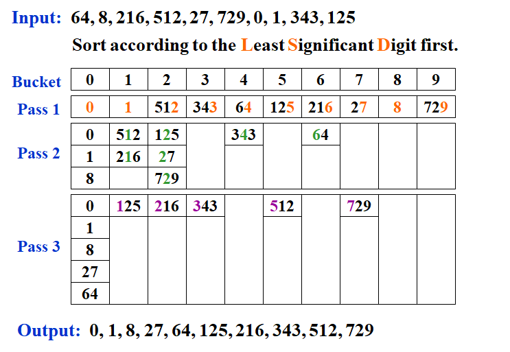

# WEEK 13

### 7.7 Quicksort

- the **fastest** known sorting algorithm in practice

#### Algorithm

```pseudocode
void Quicksort( ElementType A[ ], int N )
{
	if ( N < 2 )  return;
    pivot = pick any element in A[ ]; 
    Partition S = { A[ ] \ pivot } into two disjoint sets:
    	A1={ a in S | a <= pivot } and A2={ a in S | a >= pivot };
    A = Quicksort(A1, N1)  { pivot }  Quicksort(A2, N2);
}
```

- The pivot is placed at the right place **once and for all**.
- 要研究的问题是如何选取枢纽元和如何划分

#### Picking the Pivot

##### A Wrong Way

- Pivot = A[ 0 ]
- The worst case : A[ ] is presorted, quicksort will take $O(N^2)$ time to do noting

##### A Safe Maneuver

- Pivot = random select from A[ ]
- random number generation is **expensive**

##### Median-of-Three Partitioning

- Pivot = median(left, center, right)
- Eliminates the bad case for sorted input and actually reduces the running time by about 5%.

#### Partitioning Strategy

- 当$i$在$j$的左边时，我们将$i$右移，移过那些小于枢纽元的元素，并将$j$左移，移过那些大于枢纽元的元素
- 当$i$和$j$停止时，$i$指向一个大元素而$j$指向一个小元素，如果$i$在$j$的左边，那么将这两个元素互换
- 重复该过程直到$i$和$j$彼此交错为止
- 划分的最后一步是将枢纽元与$i$所指向的元素交换
- 如果$i$和$j$遇到等于枢纽元的键值，就让$i$和$j$都停止，因为若都不停止$T(N)=O(N^2)$
- There will be many dummy swaps, but at least the sequence will be partitioned into two equal-sized subsequences.

#### Small Arrays

- Quicksort is slower than insertion sort for small $N(\leq 20)$.
- Cutoff when $N$ gets small and use other efficient algorithms (such as insertion sort).

#### Implementation

```c
void Quicksort( ElementType A[ ], int N ) 
{ 
	Qsort( A, 0, N-1 ); 
	/*A:the array*/
	/*0:Left index*/
	/*N–1:Right index*/
}
```

```c
/* Return median of Left, Center, and Right */ 
/* Order these and hide the pivot */ 
ElementType Median3( ElementType A[ ], int Left, int Right ) 
{ ·
    int Center = ( Left+Right )/2; 
    if ( A[ Left ] > A[ Center ] ) 
        Swap( &A[ Left ], &A[ Center ] ); 
    if ( A[ Left ] > A[ Right ] ) 
        Swap( &A[ Left ], &A[ Right ] ); 
    if ( A[ Center ] > A[ Right ] ) 
        Swap( &A[ Center ], &A[ Right ] ); 
    /*Invariant: A[ Left ] <= A[ Center ] <= A[ Right ]*/ 
    Swap( &A[ Center ], &A[ Right-1 ] ); /*Hide pivot*/ 
    /*only need to sort A[ Left+1 ] … A[ Right–2 ]*/
    return A[ Right-1 ];  /*Return pivot*/ 
}
```

```c
void Qsort( ElementType A[ ], int Left, int Right ) 
{
    int i, j; 
    ElementType Pivot; 
    if ( Left + Cutoff <= Right ) 
    {   /*if the sequence is not too short*/
        Pivot = Median3( A, Left, Right );  /*select pivot*/
        i = Left;     
        j = Right – 1;  /*why not set Left+1 and Right-2?*/
        for( ; ; ) 
        { 
	 		while ( A[ ++i ] < Pivot ) { }  /*scan from left*/
	 		while ( A[ --j ] > Pivot ) { }  /*scan from right*/
	 		if ( i < j ) 
	    		Swap( &A[ i ], &A[ j ] );  /*adjust partition*/
	 		else break;  /*partition done*/
        } 
        Swap( &A[ i ], &A[ Right-1 ] ); /*restore pivot */ 
        Qsort( A, Left, i-1 );    /*recursively sort left part*/
        Qsort( A, i+1, Right );   /*recursively sort right part*/
    }  /*end if - the sequence is long*/
    else /*do an insertion sort on the short subarray*/ 
        InsertionSort( A+Left, Right-Left+1 );
}
```

> Note : If set i = Left+1 and j = Right-2, there will be an infinite loop if A[i] = A[j] = pivot.

#### Analysis

$$
T(N)=T(i)+T(N-i-1)+cN
$$

- $i$ is the number of the elements in $S_1$.

- **The Worst Case** : $T(N)=T(N-1)+cN\rarr T(N)=O(N^2)$

- **The Best Case** : $T(N)=2T(N/2)+cN\rarr T(N)=O(N\log N)$

- **The Average Case** : 

  - Assume the average value of $T( i )$ for any $i$ is $\frac{1}{N}\left[\sum^{N-1}_{j=0}T(j)\right]$
    $$
    T(N)=\frac{2}{N}\left[\sum^{N-1}_{j=0}T(j)\right]+cN\rarr T(N)=O(N\log N)
    $$

- 第$K$最大(最小)元

### 7.8 Sorting Large Structures

- Swapping large structures can be very much expensive.
- Add a pointer field to the structure and swap pointers instead – **indirect sorting**. Physically rearrange the structures at last if it is really necessary.
- Table Sort

### 7.9 A General Lower Bound for Sorting

#### [Theorem] Any algorithm that *sorts by comparisons only* must have a worst case computing time of $\Omega(N\log N)$.

- When sorting $N$ distinct elements, there are $N!$ different possible results.
- Thus any decision tree must have at least $N!$ leaves.
- If the height of the tree is $k$, then $N! \leq 2^{k-1}\rarr k\geq\log(N!)+1$ 
- Since $N!\geq (N/2)^{N/2}$ and $\log_2N!\geq(N/2)\log_2(N/2) = \Theta(N\log_2N )$
- Therefore $T(N)=k\geq c\cdot N\log_2 N$

### 7.10 Bucket Sort and Radix Sort


```pseudocode
Algorithm
{
    initialize count[ ];
    while(read in a student’s record)
        insert to list count[stdnt.grade];
    for(i = 0; i < M; i++) 
	{
        if(count[i]) output list count[i];
    }
}
```

$$
T(N,M)=O(M+N)
$$

### 7.11 Radix Sort




- $T=O(P(N+B))$ where $P$ is the number of passes, $N$ is the number of elements to sort, and $B$ is the number of buckets.