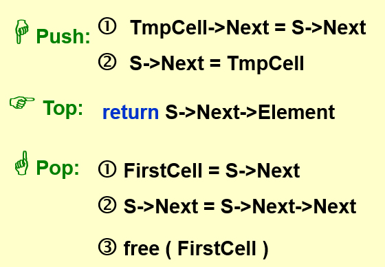

# WEEK 3

### 2.3 The Stack ADT

- Last-In-First-Out (LIFO)
- **Objects** : A finite ordered list with zero or more elements.
- **Operations** :
  -  IsEmpty
  - CreatStack
  - DisposeStack
  - MakeEmpty
  - Push
  - Top
  - Pop
- A Pop(or Top) on an empty stack in an error in the stack ADT.
- Push on a full stack is an implementation error but not an ADT error.

#### Linked List Implementation (with a header node)



- The calls to malloc and free are expensive. Simply keep another stack as a recycle bin.

  ```c
  int IsEmpty(Stack S)
  {
  	return S->Next == NULL;
  }
  ```

  ```c
  Stack CreateStack(void)
  {
  	Stack S;
  	S = malloc(sizeof(struct Node));
  	if (S == NULL)
  		Fatal Error("Out of space!");
  	S->Next == NULL;
  	MakeEmpty(S);
  	return S;
  }
  
  void MakeEmpty(Stack S)
  {
  	if (S == NULL)
  		Error("Must use CreateStack first");
  	else
  		while(!IsEmpty(S)) Pop(S);
  }
  ```

  ```c
  void Push(ElementType X, Stack S)
  {
  	PtrToNode TmpCell;
  	TmpCell = malloc(sizeof(struct Node));
  	if (TmpCell == NULL)
  		Fatal Error("Out of space!") ;
  	else
  	{
  		TmpCell->Element = X;
  		TmpCe11->Next = S->Next;
  		S->Next = TmpCell;
  	}
  }
  ```

  ```c
  ElementType Top(Stack S)
  {
  	if(!IsEmpty(S))
  		return S->Next->Element;
  	Error("Empty stack") ;
  	return O; /* Return value used to avoid warning*/
  }
  ```

  ```c
  void Pop(Stack s)
  {
  	PtrToNode FirstCell;
  	if(IsEmpty(S))
  		Error("Empty stack") ;
  	else
  	{
  		FirstCe11 = S->Next;
  		S->Next = S->Next->Next;
  		free(FirstCe11);
  	}
  }
  ```

#### Array Implementation of Stacks

```c
struct StackRecord {
	int Capacity;          /* size of stack */
	int TopOfStack;        /* the top pointer */
	/* ++ for push, -- for pop, -1 for empty stack */
	ElementType *Array;    /* array for stack elements */
}; 
```

- The stack model must be well **encapsulated(封装)**.  That is, no part of your code, except for the stack routines, can attempt to access the Array or TopOfStack variable.

- Error check must be done before Push or Pop (Top).

  ```c
  Stack CreateStack(int Max Elements)
  {
  	Stack S;
  	if(MaxEl ements < MinStackSize)
  	Error("Stack size is too small") ;
  	S = malloc(sizeof(struct StackRecord));
  	if (S == NULL)
  		Fatal Error("Out of space!!!") ;
  
  	S->Array = malloc(sizeof(ElementType) * MaxElements) ;
  	if(S->Array = NULL)
  		Fatal Error("Out of space!!!");
  	S->Capacity = Max Elements;
  	MakeEmpty(S) ;
  	return S;
  }
  ```

  ```c
  void DisposeStack(Stack S)
  {
  	if(S != NULL)
  	{
  		free(S->Array);
  		free(S);
  	}
  }
  ```

  ```c
  int IsEmpty(Stack S)
  {
  	return S->TopOfStack == EmptyTOS;
  }
  ```

  ```c
  void MakeEmpty(Stack S)
  {
  	S->TopOfStack = EmptyTOS;
  }
  ```

  ```c
  void Push(ElementType X, Stack S)
  {
  	if (IsFull(S))
  		Error("Full stack");
  	else
  		S->Array[ ++S->TopOfStack ] = X;
  }
  ```

  ```c
  ElementType Top(Stack S)
  {
  	if(! IsEmpty(S))
  		return S->Array[ S->TopOfStack ];
  	Error("Empty stack") ;
  	return O; /* Return value used to avoid warning*/
  }
  ```

  ```c
  void Pop(Stack S)
  {
  	if(IsEmpty(S))
  		Error("Empty stack") ;
  	else
  		S->TopOfStack--;
  }
  ```

  ```c
  ElementType TopAndPop(Stack S)
  {
  	if(!Is Empty(S))
  		return S->Array[ S->TopOfStack-- ];
  	Error("Empty stack");
  	return O; /* Return value used to avoid warnin */
  }
  ```

#### Application

1. Balancing Symbols

   检查括号是否平衡

   ```pseudocode
   Algorithm  {
       Make an empty stack S;
       while (read in a character c) {
           if (c is an opening symbol)
               Push(c, S);
           else if (c is a closing symbol) {
               if (S is empty)  { ERROR; exit; }
               else  {  /* stack is okay */
                   if  (Top(S) doesn’t match c)  { ERROR, exit; }
                   else  Pop(S);
               }  /* end else-stack is okay */
           }  /* end else-if-closing symbol */
       } /* end while-loop */ 
       if (S is not empty)  ERROR;
   }
   ```

2. Postfix Evaluation 后缀表达式

3. Infix to Postfix Conversion

   - 读到一个操作数时立即把它放到输出中
   - 读到一个操作符时从栈中弹出栈元素直到发现优先级更低的元素为止，再将操作符压入栈中
   - The order of operands is the **same** in infix and postfix.
   - Operators with **higher** precedence appear **before** those with **lower** precedence.
   - Never pop a ’(‘ from the stack except when processing a ‘)’.
   - When ‘(’ is not in the stack, its precedence is the highest; but when it is in the stack, its precedence is the lowest. 
   - Exponentiation associates **right to left**.

4. Function Calls (System Stack)

    

***

### 2.4 The Queue ADT

- First-In-First-Out (FIFO)
- **Objects** : A finite ordered list with zero or more elements.
- **Operations** : 
  - IsEmpty
  - CreatQueue
  - DisposeQueue
  - MakeEmpty
  - Enqueue
  - Front
  - Dequeue

#### Array Implementation of Queues

```c
struct QueueRecord {
	int Capacity ;       /* max size of queue */
	int Front;           /* the front pointer */
	int Rear;            /* the rear pointer */
	int Size;            /* Optional - the current size of queue */
	ElementType *Array;  /* array for queue elements */
 }; 
```

**Circular Queue** :


- The maximum capacity of this queue is 5.