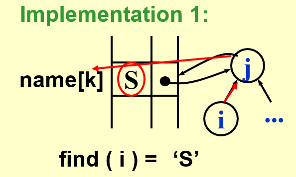

# WEEK 7

## 5 The Disjoint Set

### 5.1 Equivalence Relations

#### [Definition] A *relation R* is defined on a set *S* if for every pair of elements *(a, b)*, *a, b $\in$ S*, *a R b* is either true or false.  If *a R b* is true, then we say that *a* is related to *b*.

#### [Definition] A relation, ~, over a set, *S*, is said to be an *equivalence relation* over *S* if it is symmetric, reflexive, and transitive over *S*.

#### [Definition] Two members *x* and *y* of a set *S* are said to be in the same *equivalence class* if *x ~ y*.

---

### 5.2 The Dynamic Equivalence Problem

- Given an equivalence relation ~, decide for any *a* and *b* if *a ~ b*

  ```pseudocode
  Algorithm: (Union/Find)
  {
  	/* step 1: read the relations in */
      Initialize N disjoint sets;
      while ( read in a ~ b )
      {
      	if ( !(Find(a) == Find(b)) )  /*Dynamic(on-line)*/
  			Union the two sets;
      } /* end-while */
      /* step 2: decide if a ~ b */
      while ( read in a and b )
          if ( Find(a) == Find(b) )
          	output( true );
          else   
          	output( false );
  }
  ```

- **Elements** of the sets : $1,2,3,\cdots,N$
- **Sets** : $S_1,S_2,\cdots\,and\,S_i\bigcap S_j=\emptyset\,(if\quad i\neq j)$
- **Operations** :
  
  - Union( $i, j$ ) = Replace $S_i$ and $S_j$ by $S=S_i\bigcup S_j$
  - Find( $i$ ) = Find the set $S_k$ which contains the element $i$

---

### 5.3 Basic Data Structure

#### Union( $i, j$ )

- Make $S_i$ a subtree of $S_j$, or vice versa, that is to set the parent pointer of one of the roots to the other root.

- **Implementation 1** :

  

- **Implementation 2** :

  - The elements are numbered from 1 to N, hence they can be used as indices of an array.
  - S[ element ] = the element’s parent
  
  - Note : S[ root ] = 0 and set name = root index
  - 数组初始化全部为0
  
  ```c
  void SetUnion(DisjSet S, SetType Rt1, SetType Rt2)
  {
  	S[Rt2] = Rt1;
  }
  ```

#### Find( $i$ )

- **Implementation 1** :

  

- **Implementation 2** :

  ```c
  SetType Find(ElementType X, DisjSet S)
  {
  	for ( ; S[X]>0; X=S[X]);
  	return X;
  }
  ```

#### Analysis

- Union and find are always paired. Thus we consider the performance of a sequence of **union-find operations**.


```pseudocode
Algorithm using union-find operations:
{  
	Initialize Si = { i }  for  i = 1, ..., 12 ;
	for ( k = 1; k <= 9; k++ )  /* for each pair i R j */
	{
		if ( Find( i ) != Find( j ) )
			SetUnion( Find( i ), Find( j ) );
	}
}
```

- Worst case : $T(N)=\Theta(N^2)$

---

### 5.4 Smart Union Algorithms

#### Union-by-Size

- Always change the smaller tree

- S[Root] = -size, initialized to be -1

- **[Lemma]** Let T be a tree created by union-by-size with N nodes, then $height(T)\leq\lfloor\log_2N\rfloor+1$.

  Proved by induction. Each element can have its set name changed at most $\log_2N$ times.

- **Time complexity** of $N$ Union and $M$ Find operations is now $O(N+M\log_2N)$.

```c
/* Assumes Rootl and Root2 are roots*/
void SetUnion(DisjSet S, SetType Root1, SetType Root2)
{
    if (S[Root1] <= S[Root2])
    {
        S[Root1] += S[Root2];
        S[Root2] = Root1;
    }
    else
    {
        S[Root2] += S[Root1];
        S[Root1] = Root2;
    }
}
```

#### Union-by-Height

- Always change the shallow tree
- 保证所有的树的深度最多是$O(logN)$

```c
/* Assumes Rootl and Root2 are roots*/
void SetUnion(DisjSet S, SetType Root1, SetType Root2)
{
	if ( S[Root2] < S[Root1])  /*Root2 is deeper set*/
		S[Root1] = Root2;      /*Make Root2 new root*/
	else
	{
		if (S[Root1] == S[Root2])  /*Same height*/
			S[Root1]--;
		S[Root2] = Root1;
	}
}
```

---

### 5.5 Path Compression

- 从X到Root的路径上的每一个结点都使它的父结点变成Root

```c
SetType Find( ElementType X, DisjSet S )
{
    if ( S[ X ] <= 0 )    
    	return X;
    else 
    	return S[ X ] = Find( S[ X ], S );
}
```

```c
SetType Find( ElementType X, DisjSet S )
{   
	ElementType root, trail, lead;
    for ( root = X; S[ root ] > 0; root = S[ root ] );  /* find the root */
    for ( trail = X; trail != root; trail = lead )
    {
    	lead = S[ trail ];   
    	S[ trail ] = root;   
    }  /* collapsing */
    return root;
}
```

- Note : Not compatible with union-by-height since it changes the heights.  Just take “height” as an estimated **rank**.

---

### 5.6 Worst Case for Union-by-Rank and Path Compression

#### [Lemma] Let $T(M,N)$ be the maximum time required to process an intermixed sequence of $M\geq N$ finds and $N-1$ unions, then $k_1M\alpha(M,N)\leq T(M,N)\leq k_2M\alpha(M,N)$ for some positive constants $k_1$ and $k_2$.

- Ackermann’s Function  
  $$
  A(i,j)=\left\{
  \begin{array}{rcl}
  2^j && {i=1,j\geq1}\\
  A(i-1,2) && {i\geq2,j=1}\\
  A(i-1,A(i,j-1)) && {i\geq2,j\geq2}\\
  \end{array} \right.
  $$
  
  $$
  A(2,4)=2^{2^{2^{2^2}}}=2^{65536}
  $$
  
- $\alpha(M,N)=min\{i\geq1|A(i,\lfloor M/N\rfloor)>\log N\}\leq O(\log^*N)\leq4$

  $\log^*N$ (inverse Ackermann function) = number of times the logarithm is applied to $N$ until the result $\leq1$.


p.s. 一共有五种算法，注意看清题设

- No smart union

- Union-by-size

- Union-by-height

- Union-by-size + Path Compression

- Union-by-height + Path Compression